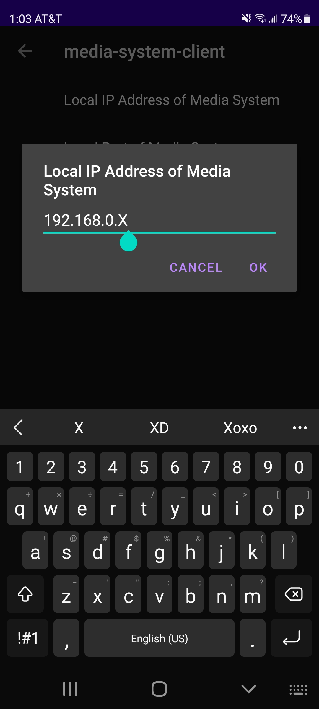

# Media System Client
--- 

Custom app for controling my [LibreELEC](https://libreelec.tv/) media system running on a [Raspberry Pi 4](https://www.raspberrypi.com/products/raspberry-pi-4-model-b/).

The app works by sending POST requests to a [KODI](https://kodi.tv/) [JSON-RPC](https://kodi.wiki/view/JSON-RPC_API/v10) API over my local network.

#### Currently Supports
- Basic video playback controls
- Basic volume support
- Arrow key interaction
- Text input
- Basic Power control
- OSD toggle

#### Potentional Enhancements
- Remote Spotify playback
- Youtube addon controls
- Wireless room light control

### Philosphy
The objective behind creating this app is to be rid of the proprietary operating system installed on my Roku TV. By using LibreELEC and controlling it through a custom app on my phone, the media streaming process can be end-to-end open source.

#### Example Screenshots

    
    
    

